# Device Info
* enbrighten - WFD4201E
* Model: WFD4201E
* FCC ID: QOB-WFD4201
* https://fcc.report/FCC-ID/QOB-WFD4201/
* 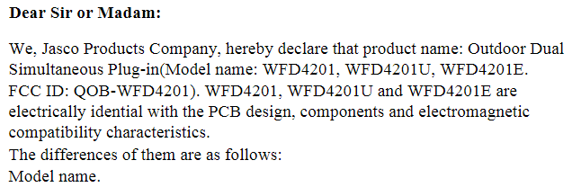
	* https://fcc.report/FCC-ID/QOB-WFD4201/4852019
* No Internal Photos
## Acquisition
* 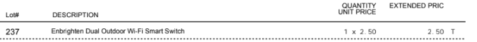
# Teardown & Connections
## External Photos
* 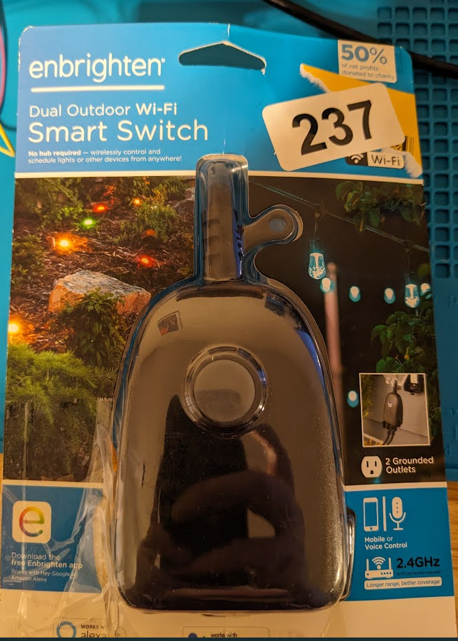
* 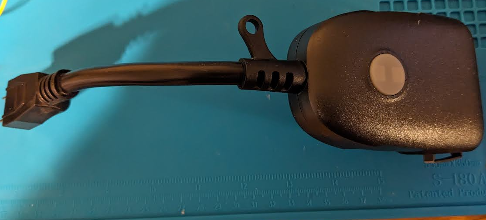
* 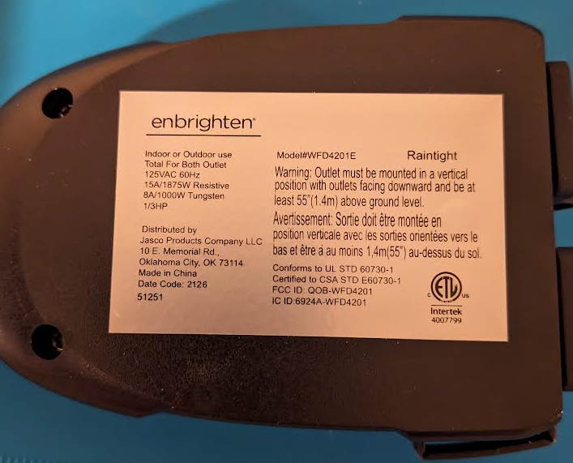
## Internal Photos
* 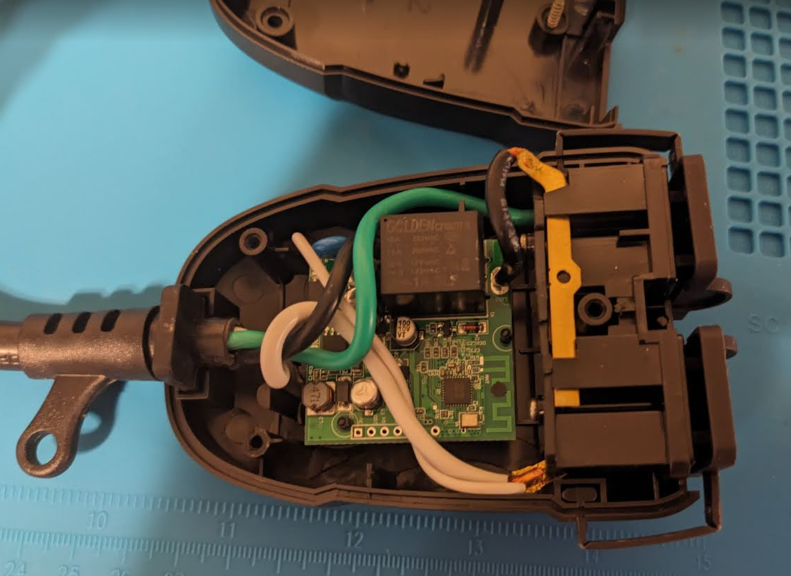
* Top of PCB has pin headers [3v, IO0, TX, RX, GND]
	* These did not function when attempting to read and write to the chip. The backside of the PCB had additional pads that worked correctly when trying to interact.
* 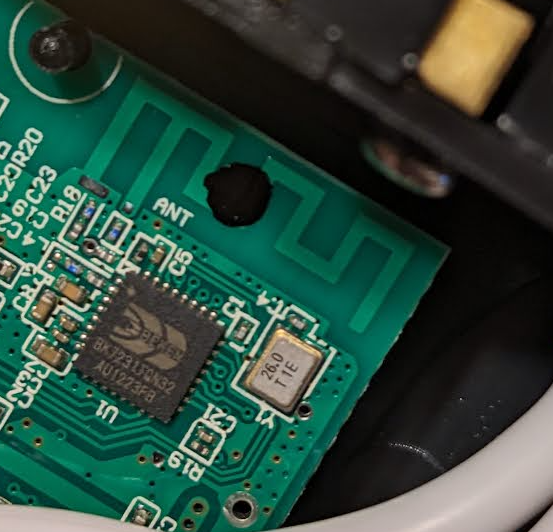
* **BK7231TQN32 Chip**
* 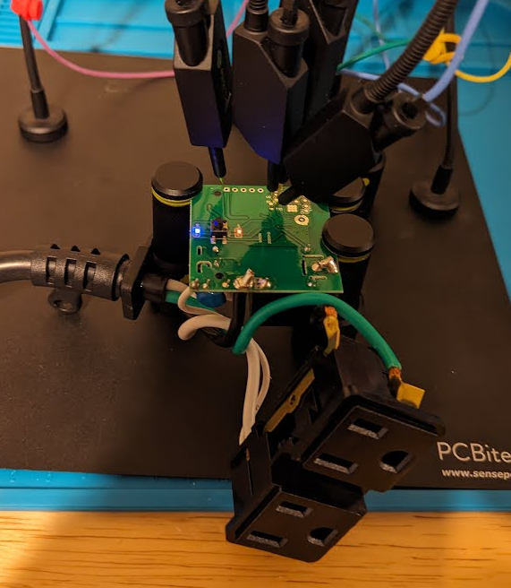
* 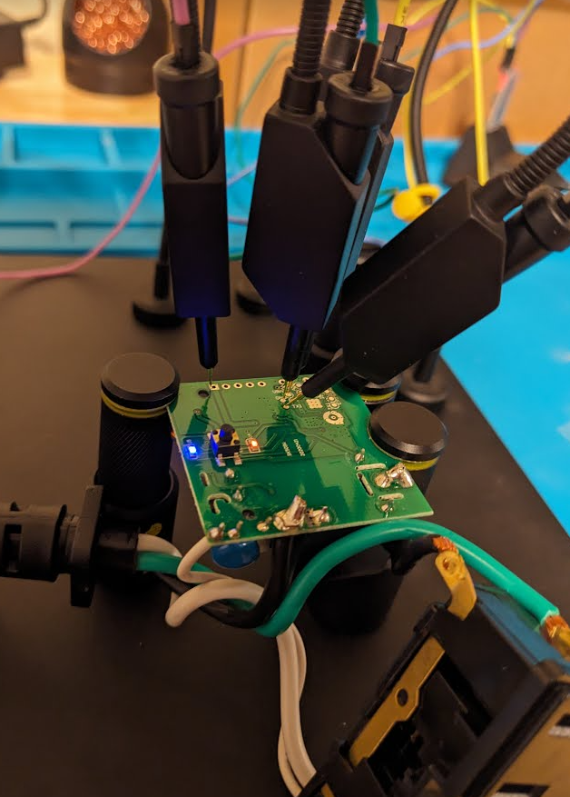
* Backside of the PCv with pads connected for GND, TX, RX. The 3.3v Pad was used from the 5 pin row header visible from the front/back.
# Firmware Dump
* ltchiptool was used to interact with the BK7231T chip.
	* https://github.com/libretiny-eu/ltchiptool
## Chip Info
* 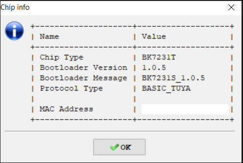
## Read Flash
* 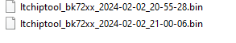
* Two copies downloaded from the chip >> 2MB flash
* 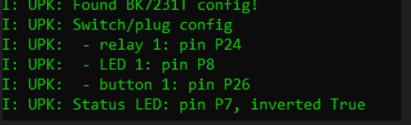
* Read back the firmware to view the TUYA pin config
# ESPHome
## ESPHome config
* Pin config information used to generate a ESPHome YAML config file for the device
```yml
esphome:
  name: enbrighten-dual-2
  friendly_name: enbrighten-dual-2


bk72xx:
  board: generic-bk7231t-qfn32-tuya

logger:
web_server:
captive_portal:
mdns:
api:
ota:
wifi:
  ssid: !secret wifi_ssid2
  password: !secret wifi_password2
  fast_connect: true
  manual_ip:
    static_ip: 192.168.XX.XX
    gateway: 192.168.X0.1
    subnet: 255.255.255.0

text_sensor:
  - platform: libretiny
    version:
      name: LibreTiny Version

output:
  - platform: libretiny_pwm
    id: output_led_1
    pin:
      number: P8
      inverted: true

light:
  - platform: monochromatic
    id: light_switch_1
    output: output_led_1

binary_sensor:
  - platform: gpio
    id: binary_switch_1
    pin:
      number: P26
      inverted: true
      mode: INPUT_PULLUP
    on_press:
      then:
        - switch.toggle: switch_1

switch:
  - platform: gpio
    id: switch_1
    name: Relay 1
    pin: P24
    on_turn_on:
      - light.turn_on: light_switch_1
    on_turn_off:
      - light.turn_off: light_switch_1

status_led:
  pin:
    number: P7
    inverted: true
```
* Config file built, downloaded and flashed using LTChiptool
## ESPHome Operation
* Operation through home assistant app and webserver on chip successfully turns the single relay on/off
* 
